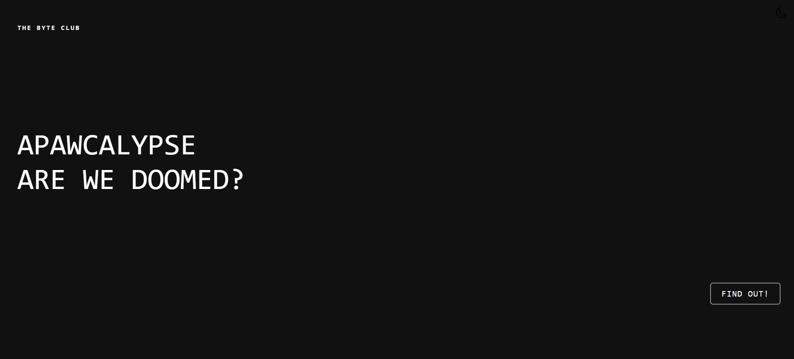
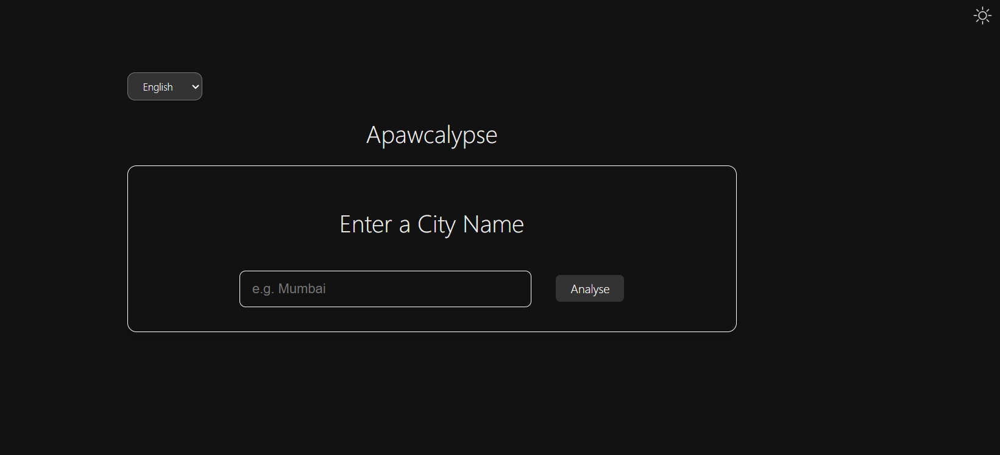
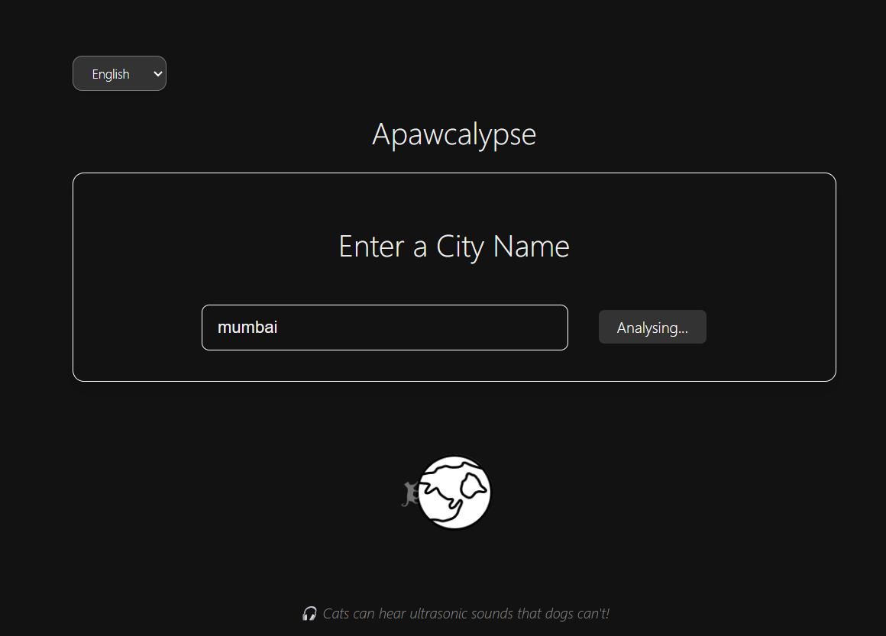
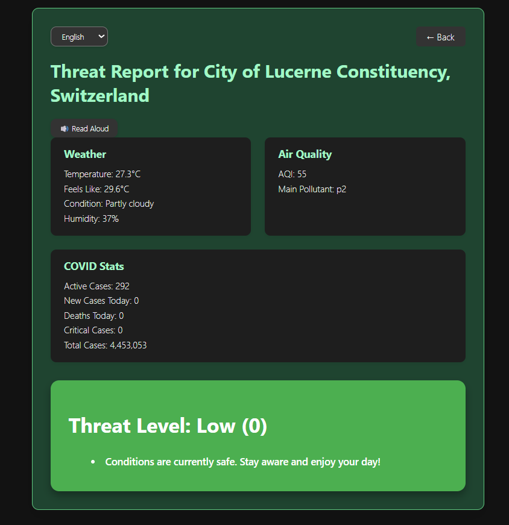
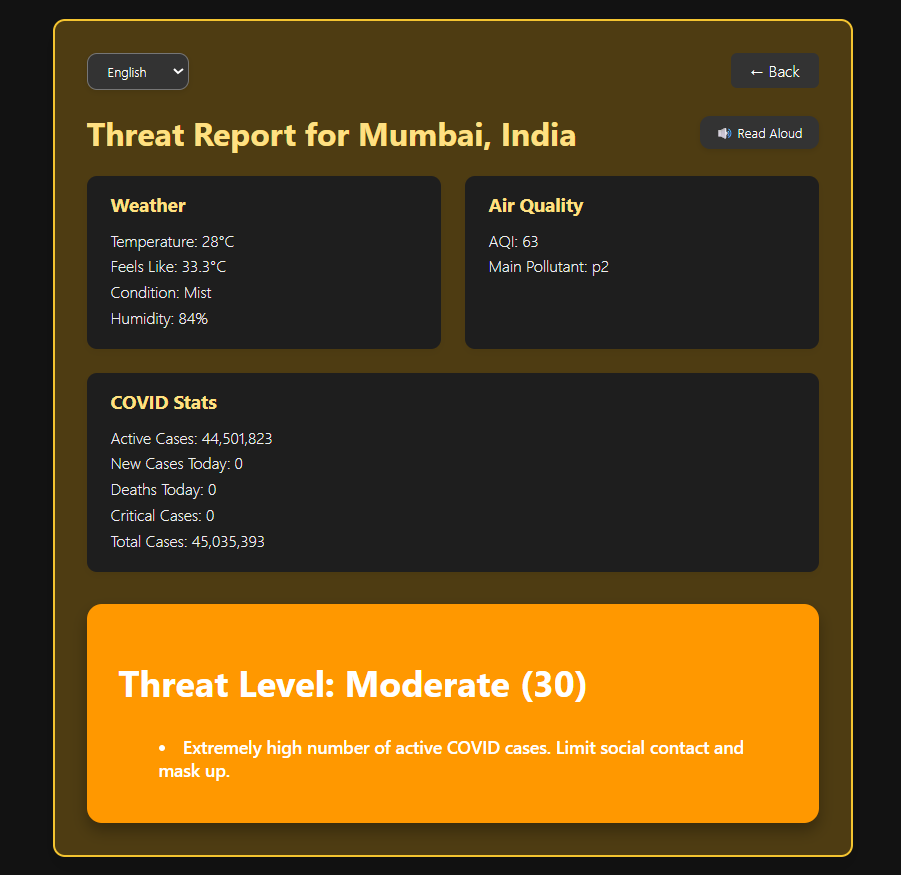
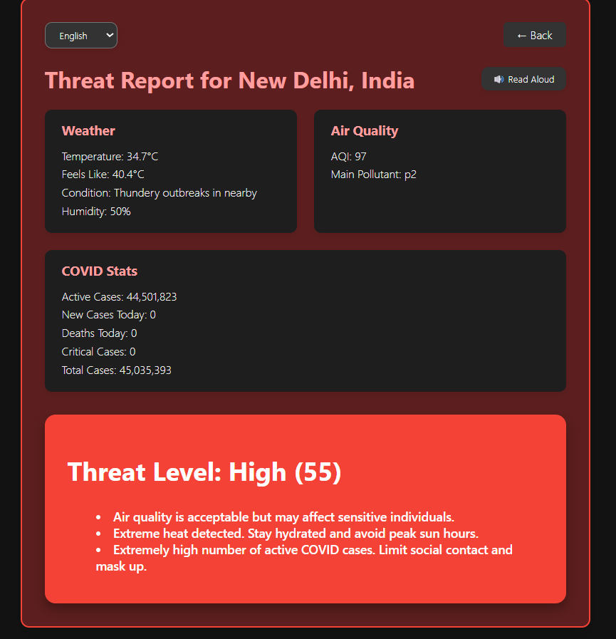

# Apawcalypse

**Apawcalypse** is a web application designed to provide users with real-time critical information about environmental and health threats in cities, including weather, air quality, COVID-19 stats, and safety tips. It also features immersive UI animations, background music, and audio alerts powered by text-to-speech technology.

---

## Features Implemented

| Feature                               | Description                                                           | Difficulty Level     |
|-------------------------------------|-----------------------------------------------------------------------|---------------------|
| **Creative 404/Error Handling**     | Fallback cute cat image in case the city data is not available        | Easy              |
| **Dark Mode Support**               | Creative UI with Persistent light and dark modes                      | Easy                |
| **Custom Loading States**           | A theme related loading spinner and some random cat facts             | Easy              |
| **Dynamic Theming based on API data**| The color of the result page changes according to the score calculated | Medium              |
| **Multilingual Support**            | Supports multiple languages for the users                             | Medium              |
| **The Story Mode**                  | It follow a fun cat story (watch the demo video to know more 🐱)         | Medium                |
| **Text to Speech**                  | An option that allows users to listen to the output data on the results page |Hard            |
| **Accessibility Features**          | Our website supports only such colors that can be seen by anyone including visually impaired people |Hard            |
 

---

##  APIs Used & Their Roles

**1. GeoDB Cities API (via RapidAPI)**  
Used to fetch the latitude, longitude, and country of any user-input city. This allows all other APIs to use accurate location-based data.

**2. WeatherAPI**  
Provides real-time weather information like temperature, humidity, feels-like temperature, and weather conditions for a given city.

**3. AirVisual API (IQAir)**  
Fetches current air quality metrics such as AQI (Air Quality Index) and the main pollutant for the provided location.

**4. The Cat API**  
Displays a random cat image when the entered city is invalid or any API fails, providing a lighthearted fallback.

**5. Web Speech API**  
Used for Text to Speech conversion.

---

## Screenshots


 



 

 






---

## Setup and Testing Instructions

### Installation

1. Clone the repository:
   ```bash
   git clone https://github.com/Ariyan-25/apawcalypse2.git
   cd apawcalypse

2. Create a .env file and paste
    RAPIDAPI_KEY=your_rapid_api_key
    OPENWEATHER_API_KEY=your_openweather_api_key
    AIRVISUAL_API_KEY=your_airvisual_api_key
    CAT_API_KEY=your_cat_api_key 
