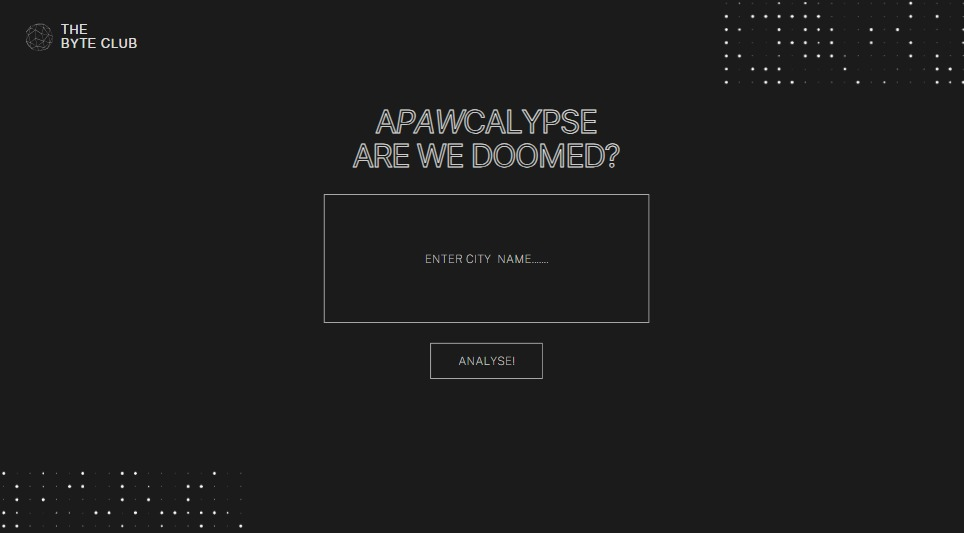

#  APAWCALYPSE

**APAWCALYPSE** is a safety dashboard that helps users assess real-time environmental and health threats in any city around the world. From pollution to pandemics, the app calculates a threat score and provides survival tips and when things go wrong, it sends you a cat. 🐱

---

##  Tech Stack

- **Frontend**: HTML, CSS (custom dark mode), JavaScript, Chart.js  
- **Backend**: Python, Flask  
- **Styling**: Responsive UI with a futuristic dark-themed dashboard  
- **Visualization**: Dynamic charts & clean UI feedback  
- **Architecture**: Modular Python utilities with `.env` for secure API usage

---

##  APIs Used & Their Roles

**1. GeoDB Cities API (via RapidAPI)**  
Used to fetch the latitude, longitude, and country of any user-input city. This allows all other APIs to use accurate location-based data.

**2. WeatherAPI**  
Provides real-time weather information like temperature, humidity, feels-like temperature, and weather conditions for a given city.

**3. AirVisual API (IQAir)**  
Fetches current air quality metrics such as AQI (Air Quality Index) and the main pollutant for the provided location.

**4. The Cat API**  
Displays a random cat image when the entered city is invalid or any API fails — providing a lighthearted fallback.

##  How It Works

1. User enters a city name  
2. The app gathers:
   - Weather information (temperature, humidity, condition)
   - Air quality index (AQI) and pollutant
   - Live COVID-19 statistics  
3. The system then:
   - Calculates a **Threat Score** (0–100)
   - Generates survival **tips** based on real-world risk
   - Categorizes danger into **Low**, **Moderate**, or **High**
4. If the city is not found or data fails, a cute cat image is shown instead

---

##  Threat Score Logic

The score is based on:

- **Air Quality (AQI)**
  - Higher AQI = higher score
- **Feels-Like Temperature**
  - Extreme heat or cold adds points
- **Adverse Weather Conditions**
  - Storms, rain, or wind trigger alerts
- **COVID-19 Stats**
  - High active cases increase risk

| Score Range | Level     |
|-------------|-----------|
| 0–20        | 🟢 Low     |
| 21–49       | 🟡 Moderate |
| 50+         | 🔴 High    |

Each factor also adds relevant **tips** for survival.

---

## Prototype

### Homepage Input

### City

### Weather

### Aqi

### Covid

### Threat

### 🐱 Cat

---

